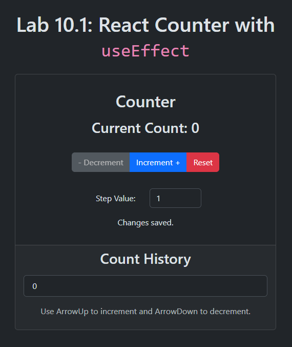

# Lab 10.1: React Counter

[Karl Johnson](https://github.com/hirekarl)  
2025-RTT-30  
<time datetime="2025-08-01">2025-08-01</time>  



## Overview
### Viewer Instructions
1. In the terminal, run:

```bash
cd react-counter && npm i && npm run dev
```

2. Navigate in the browser to http://localhost:5173.

### Submission Source
Counter app behavior can be found in [`./react-counter/src/components/Counter/Counter.tsx`](./react-counter/src/components/Counter/Counter.tsx).

### Reflection
The main challenge I faced with this lab had to do with a) making sure the Count History didn't show with two `0` items on initial load, which is a side effect of `StrictMode`; b) handling the logic to ensure `count` can never go below 0; and c) implementing the `KeyboardEvent` event handlers.

The first item involved thinking about how to ensure the `countHistory` is updated only if the current value is different from the last value. This involved both making sure conditions were such that any action taken on `Counter` changes the value of `count`, and adding an `if` guard in the associated `useEffect` to only change `count` if the `countHistory[countHistory.length - 1]` is different from `count`.

The second item amounted to finding this logic:

```typescript
const handleDecrement = useCallback((): void => {
  setCount((prevCount) =>
    prevCount - stepValue <= MIN_COUNT ? MIN_COUNT : prevCount - stepValue
  )
}, [stepValue])
```

Figuring out the `KeyboardEvent` handling amounted to researching `KeyboardEvent` on MDN and figuring out that the event listeners needed to be placed on the `window` element.

At present, the `"Saving to localStorage..."` message never shows. Part of this has to do with the fact that `setStatus` gets called twice within the same `useEffect` block; another is that saving to `localStorage` is very fast. With more time, I'd like to figure out how to make that feature more visually interesting.

## Assignment
In this lab, you will create a set of reusable UI components for your company’s internal component library. You will practice creating TypeScript React components with proper prop typing, component composition, and prop handling. This lab focuses on component creation, TypeScript interfaces, prop handling, and component composition using React and TypeScript.
